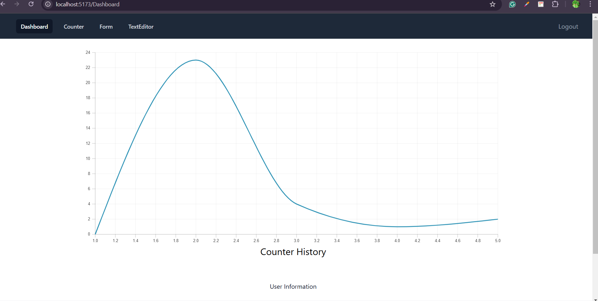
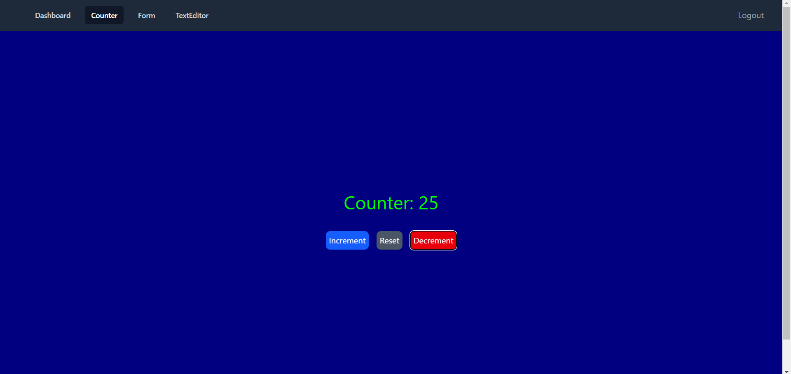
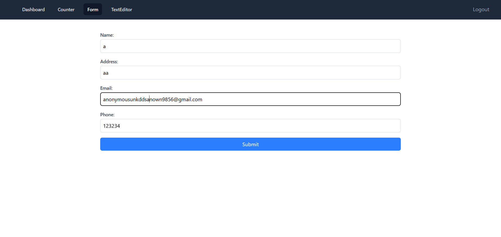
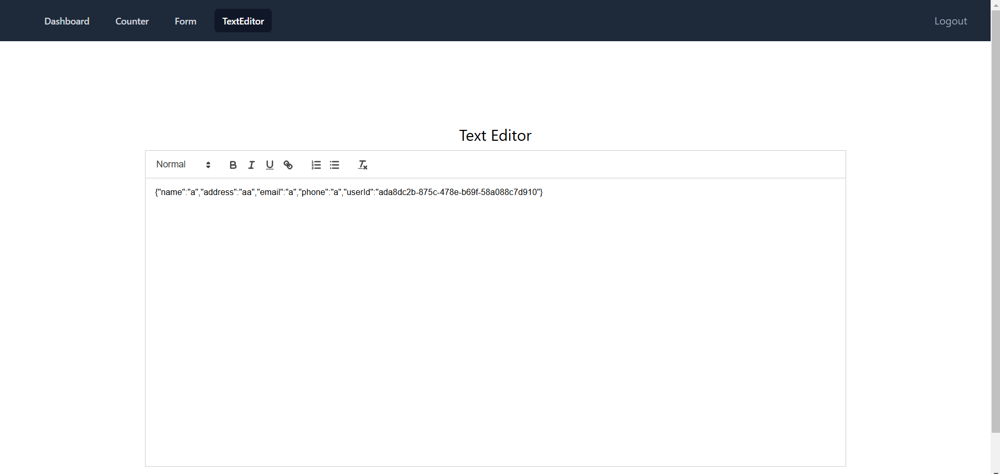

# Documentation

This is a React application built as an assignment from upliance.ai. The application uses local storage Authentication for user sign-in and sign-up handle tasks like text editor, form submission and background color change according to a counter value.

## Live Demo

You can view the live demo of the application here:

[Live Demo](https:///)

## Features

-  Authentication with local storage.
-  A Counter Component with a dynamic background level.
-  A User Data Form with auto-generated user IDs and local data persistence.
-  A Rich Text Editor for visualizing user data.
-  A Dashboard Visualization using React Charts.
-  Smooth UI animations with React Spring.


- **Setup Organisation**
  - Users can enter company name, website URL, and description.
  - Dummy data is used to display scraped webpages, with statuses showing which pages have been scraped and which are pending.

- **Chatbot Integration & Testing**
  - **Test Chatbot**: Opens a dummy chatbot integration on the client's website.
  - **Integrate on Website**: Provides easy-to-follow instructions for integrating the chatbot code into the website.
  - **Test Integration**: Opens a new screen to test the integration.

## Tech Stack

- React (Functional Components with Hooks)
- Tailwind CSS (Styling)
- React Router DOM (Navigation)
- React Spring (Animations)
- React Charts (Data Visualization)
- React Quill (Rich Text Editor)


## Screenshots

Dashboard



Counter



Form



TextEditor




## Run Locally

Clone the project

```bash
  git clone https://github.com/BraveAnarchist/upliance
```

Go to the project directory

```bash
  cd upliance
```

Install dependencies

```bash
  npm install
```

Start the server

```bash
  npm run dev
```